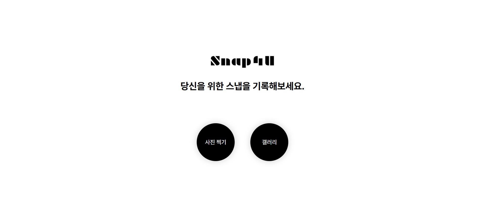
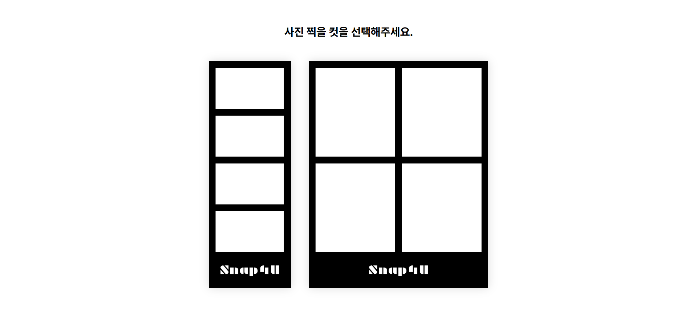
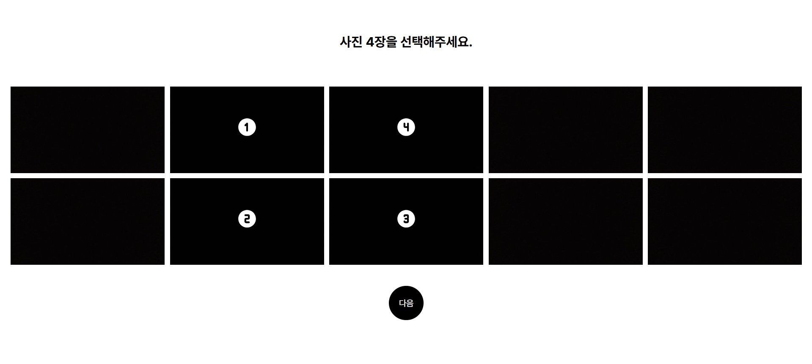
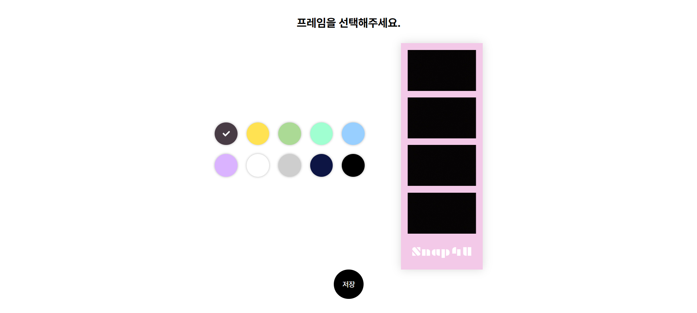
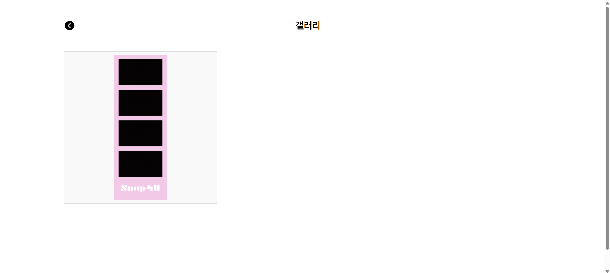
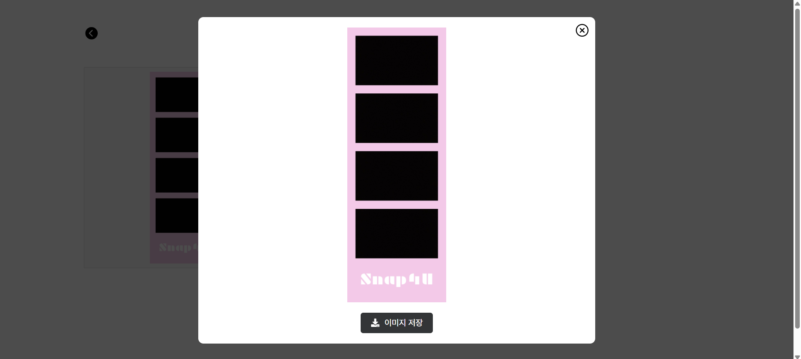

# Snap4U

> 언제 어디서든 당신을 위해 스냅을 기록하세요! 사진 촬영 후 원하는 프레임을 선택하면 나만의 특별한 스냅을 남길 수 있습니다 :)

<br/>

## 기능 소개

### 📸 사진찍기

-   원하는 컷을 선택한 후 10장을 찍습니다.
-   찍은 사진 중 4장을 선택하여 원하는 프레임 색상을 고르면 이미지가 저장됩니다.

### 🖼 갤러리

-   촬영한 사진들을 갤러리에서 조회할 수 있습니다.
-   다운로드 버튼을 누르면 해당 이미지가 저장됩니다.

<br/>

## 화면 구성

#### 🏠 홈 화면



#### 🤚 컷 선택 화면



#### 📸 사진 촬영 화면


#### 📷 사진 선택 화면



#### 🎞️ 사진 프레임 선택 화면



#### 🖼️ 갤러리 조회 화면




<br/>

## 설치 방법

OS X & 리눅스:

```sh
npm install
```

윈도우:

```sh
npm install
```

<br/>

## 사용 예제

스크린 샷과 코드 예제를 통해 사용 방법을 자세히 설명합니다.

_더 많은 예제와 사용법은 [Wiki][wiki]를 참고하세요._

<br/>

## 개발 환경 설정

모든 개발 의존성 설치 방법과 자동 테스트 슈트 실행 방법을 운영체제 별로 작성합니다.

```sh
npm install
npm test
```

<br/>

## 업데이트 내역

-   DB를 SQLite에서 Supabase로 변경하여 배포 완료

-   향후 계획: React Native 및 TypeScript 적용 예정, 회원가입 및 로그인 구현하여 사용자마다 자신의 갤러리를 이용할 수 있게 개선 예정

<br/>

## 정보

-   개발자: [khskys0805](https://github.com/khskys0805)

-   배포 링크: [Snap4U 배포 사이트](https://snap4-u.vercel.app/)

-   라이센스: XYZ 라이센스를 준수하며 LICENSE에서 자세한 정보를 확인할 수 있습니다.

[https://github.com/yourname/github-link](https://github.com/dbader/)

## 기여 방법

1. Snap4U 레포지토리를 포크합니다.
2. 새 브랜치를 생성합니다. (예: git checkout -b feature/새로운기능)
3. 변경 사항을 커밋합니다. (예: git commit -am 'Add 새로운 기능')
4. 포크한 레포지토리에 변경 사항을 푸시합니다. (예: git push origin feature/새로운기능)
5. 원본 레포지토리에 풀 리퀘스트를 생성합니다.
